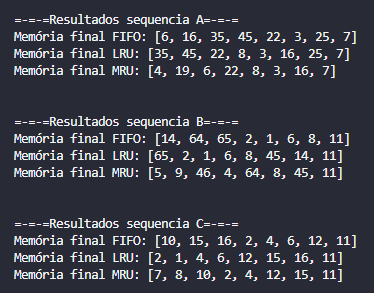

# TDE2-Mapeamento-de-Memoria-CACHE
Trabalho da Disciplina de Performance em Sistemas Ciberfísicos

Sistemas de Informação, 4° período Turma B    
Integrantes do Grupo:

- Adrian Antônio de Souza Gomes,
- Bruna da Silva Carnelossi,
- João Pedro de Souza Quintiliano da Silva,
- Lucas Azzolin Haubmann

## Sobre a atividade:
*Objetivo:* Implementar na linguagem de preferência os seguintes algoritmos:
* Algoritmo FIFO;
* Algoritmo LRU;
* Algoritmo MRU;

Em seguida, testar as seguintes sequências de páginas para 8 quadros:

**Sequência A)** 4, 3, 25, 8, 19, 6, 25, 8, 16, 35, 45, 22, 8, 3, 16, 25, 7;  
**Sequência B)** 4, 5, 7, 9, 46, 45, 14, 4, 64, 7, 65, 2, 1, 6, 8, 45, 14, 11;    
**Sequência C)** 4, 6, 7, 8, 1, 6, 10, 15, 16, 4, 2, 1, 4, 6, 12, 15, 16, 11.

## Entendendo os Algoritmos:
Os algoritmos **FIFO**, **LRU** e **MRU** são políticas de substituição usadas em gerenciamento de memória e cache para determinar qual dado remover quando é preciso liberar espaço.

### Agorítmo FIFO (First In, First Out):
O algoritmo FIFO remove o item mais antigo (como a tradução diz primeiro a entrar é o primeiro a sair). ELe gerencia os itens em uma fila. A primeira página ou bloco a ser inserido na memória é o primeiro a ser removido quando a memória está cheia. Apesar de simples e fácil de implementar, pode acabar removendo itens que estão sendo usados com frequência, resultando em desempenho com mais ineficiência.

### Agorítmo LRU (Least Recently Used):
Direntemente do FIFO, o LRU veio para resolver sua ineficiência removendo o item menos recentemente usado. Ele monitora quais páginas foram menos usadas recentemente e quando ocorre uma falha de página, o algoritmo substitui a página que não foi acessada pelo maior período de tempo.
alinhando melhor com a localidade de referência do programa.

### Agorítmo MRU (Most Recently Used):
Já a ideia principal MRU é substituir a página ou bloco que acabou de ser acessado. Essa política é menos comum para substituição de cache porque os dados frequentemente usados são geralmente mantidos porém em alguns casos específicos, como na substituição de páginas em um processo que acessou uma área do código que não usará mais, o MRU pode ser útil. Ele pode ser adaptado para manter dados em cache por mais tempo, ao custo de uma sobrecarga de processamento. Em geral, tem um desempenho pior que o LRU e FIFO para a maioria das aplicações, pois descarta dados que podem ser necessários novamente no futuro próximo. 

## Resolução da Atividade:
Para a implementação dos algoritmos foi decidido utilizar a linguagem ***Python*** devido ao maior domínio da mesma por todos os integrantes do grupo. Foram criados 2 arquivos alocados neste ropositório o qual apresentam o mesmo código - sendo um deles com comentários e outro sem. 

Print do Resultado no Terminal:

## Respondendo Perguntas:

- Qual quadro na memória possuirá a página 7 ?
- Qual quadro na memória possuirá a página 11?
- Qual quadro na memória possuirá a página 11?
- Qual a melhor politica de substituição e por quê?

## Link do Vídeo:
link do youtube aqui
